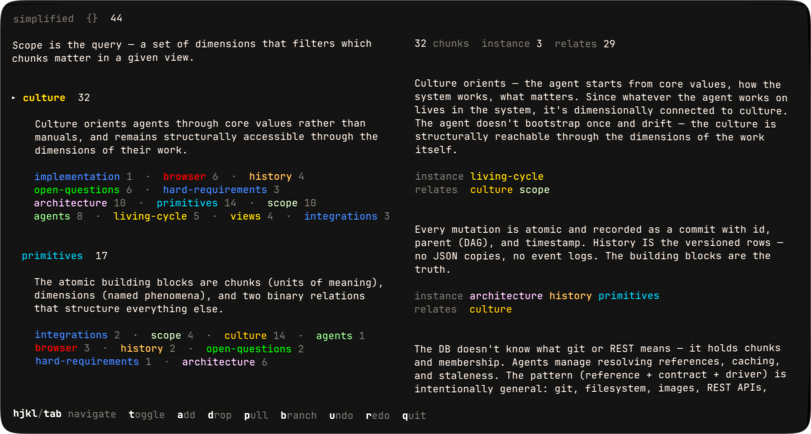

# OpenLight

A substrate for knowledge, computation, and navigation. One primitive — the chunk — with placement, atomic history, and spec enforcement. Any reader (human, agent, browser, shell, website) navigates the same structure.

## Why `💡`

Context is the portal to the raw power of LLMs. The quality of what goes into the context window determines the quality of what comes out. Existing tools are monolithic — you don't control what fills the context. OpenLight is about structuring knowledge so that queries produce the right context, declaratively and composably.

The knowledge persists. Models can be swapped. The structure is what endures.

## The Design `🧱`

**One primitive: Chunk.** Spec (structural contract, system-enforced) + body (JSON object, reader-interpreted). A chunk can serve as content, identity, archetype, or connection — the role emerges from how it's placed.

**One mechanism: Placement.** A chunk placed on another chunk. Type is instance (IS a member) or relates (is ABOUT). Optional seq for ordering. Placement creates scopes, hierarchy, and connections.

**Spec enforcement.** Archetypes define structural contracts. The system rejects non-conforming instances. Meaning is reader-determined. Shape is system-enforced.

**Atomic history.** Every mutation is a commit. Full history, branching, lossless. Git's model applied to knowledge.

See `substrate.md` for the full specification.

## Hard Requirements `⚡`

1. **General-purpose.** Not for agents only. Content goes in; what comes out depends on the reader.
2. **Lossless.** Nothing is destroyed. Knowledge evolves through addition.
3. **Transparent relationships.** No opaque scores. The meaning is in the content and its structure.
4. **No imposed hierarchy.** Structure depends on the reader's focus point.
5. **The system is the identity.** The knowledge is what persists. Models can be swapped — the knowledge cannot.

## The Living Cycle `🔄`

Vision — threads being explored, not yet fully specified.

**Culture orients.** The agent starts from culture — core values, how the system works, what matters. Relatively stable, changes deliberately.

**Continuous grounding.** Whatever the agent works on lives in the system, structurally connected to culture. The agent doesn't bootstrap once and drift — the culture is reachable through the scope of the work itself.

**Lossless records.** Agents store everything — tool calls, sessions, reasoning. Scope structures this so it's approachable without reading everything. You scope into what matters.

**Caretakers.** Archetypal agents whose role is to tend the system. They ingest what other agents produced, compare against culture, check integrity. Different archetypes for different kinds of care — contradiction detection, culture evolution, reverse testing.

**Purification through reversal.** Fresh agents as mirrors. Embed knowledge, then give a fresh agent only the system and ask questions. If it can't reconstruct the right understanding, the embedding is impure. Asking is verifying.

**Culture evolves.** Not by drifting but through deliberate integration of what's been learned.

**Code as derivation.** The substrate holds knowledge and contracts. Code is derived from that knowledge — generated by agents of the system. Knowledge first, code derived. The code is a mirror of understanding, never the source of truth. Reverse testing verifies purity: regenerate the code from knowledge alone — if it still works, the knowledge is complete.

## The Interface `🪟`

An optional GUI layer. Views are scopes — deterministic, composable, tileable. UI derived from type contracts — invocables don't build UI, the system resolves typed inputs to UI modules. The broader vision: a scope-based way of interfacing with all programs, not just the substrate. Forming — the direction is emerging but not proven.

See `interface.md` for the exploration.

## Culture `🌱`

Discovery over invention — the system already exists, we uncover it. Exploration before building. Distinguish thought from truth. Simplicity and naturalness — if it feels forced, it's wrong. Proportionate effort. Transparency over opaque scores. Agent-interpreted values, to be refined by the author.

## Implementation `🔧`

The substrate spec has evolved from five primitives to the current one-primitive model described in `substrate.md`.

**Pilot** — TypeScript + Bun. Substrate library, CLI, UI, and invocables proving the full loop end-to-end. See `pilot.md` for the spec. Lives in `pilot/`.

**Archive** — The original Zig CLI and Go TUI browser implemented the earlier five-primitive model. Preserved in `archive/` for reference.

## Files `📄`

- `substrate.md` — the spec: chunk primitive, placement, schema, archetypes, peers
- `interface.md` — interface layer: scope-based window manager, UI from type contracts
- `pilot.md` — pilot spec: substrate + UI + invocables, end-to-end proof
- `pilot/` — pilot implementation (TypeScript + Bun)
  - `ol/` — substrate library and CLI (built)
  - `ui/` — SvelteKit app (planned)
  - `invocables/` — claude invocable (planned)
- `research/` — ecosystem research, methodology analysis, agent research
  - `landscape.md` — what other systems do, what's unique here
  - `agent-research.md` — agent architecture, API formats, tools, containment
  - `icm-clief-notes.md` — Jake Van Clief's Interpretable Context Methodology
  - `shell-research.md` — declarative model, atomic filesystems, stress tests, biology mapping
- `archive/` — previous work: Zig CLI, Go TUI browser, shell exploration. Preserved for reference.

